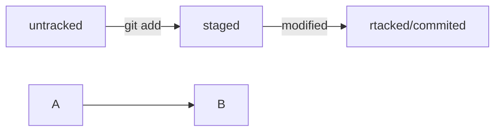

# Git template

---

1. Initialize new project 

```Bash
git init
```

2. Connect it to remout repository

```Bash
git remote add origin 'your link'

```

3. Make any file

```Bash

touch anyFile.txt

```

4. Updatefile


```Bash

vim anyFile.txt

```

5. Track anyFile.txt


```Bash

git add .

```

6. Commit file


```Bash

git commit -m 'your message'

```

7. Push it 


```Bash

git push -u origin main

```

8. Read logs 

```Bash

git log

```



```
